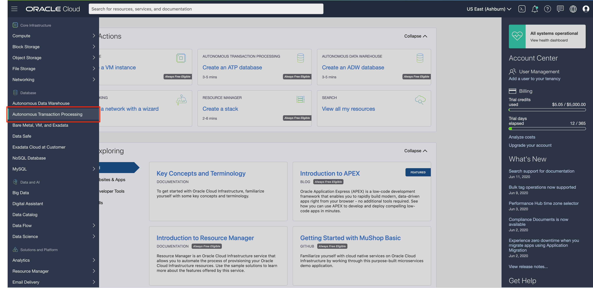
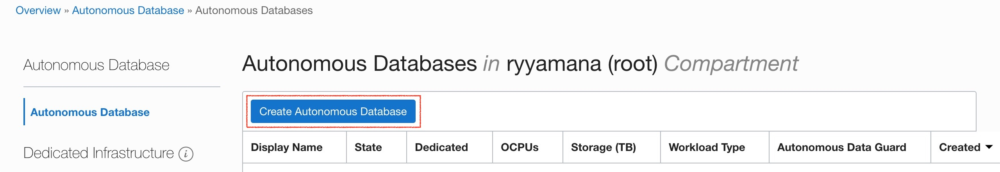
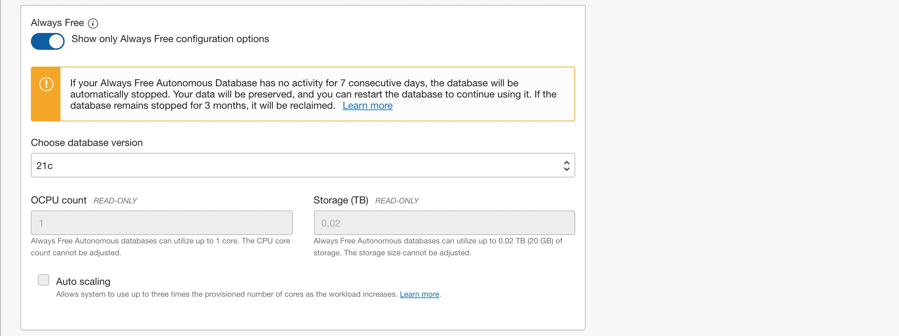
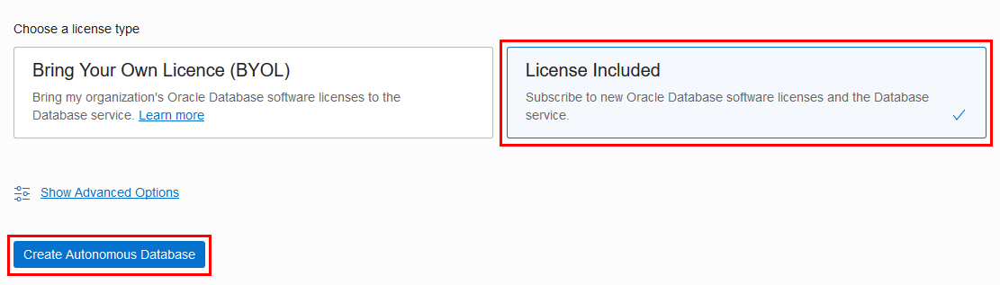
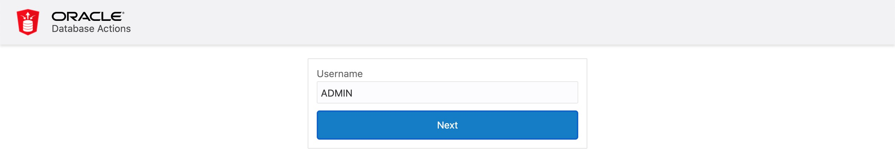
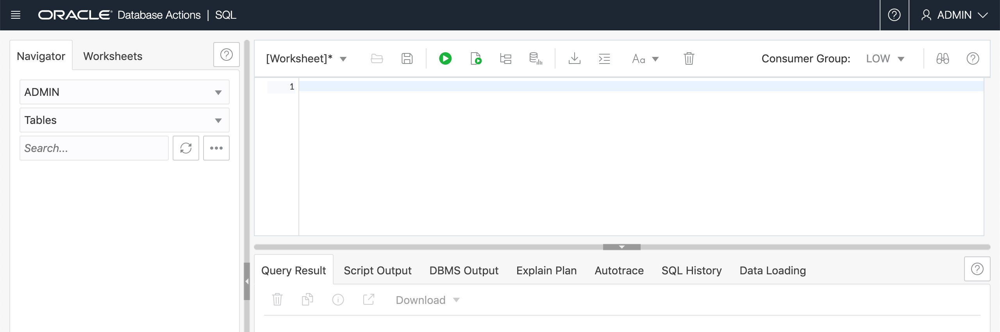

# Setup Graph Server with Autonomous Database

# Introduction

The labs in this workshop walk you through the steps to deploy the Graph Server and Client package with Autonomous Database (ADB) instance. You will provision a new ADB instance, and integrate with the Graph Server using its Marketplace image.

Estimated Workshop Time: 30 min

# Provision Autonomous Database Shared Instance

## **STEP 1**: Choose ATP from the Services Menu

1. Login to the Oracle Cloud.

2. Once you are logged in, you are taken to the cloud services dashboard where you can see all the services available to you. Click the navigation menu in the upper left to show top level navigation choices.

    **Note:** You can also directly access your Autonomous Data Warehouse or Autonomous Transaction Processing service in the **Quick Actions** section of the dashboard.

    

3. The following steps apply similarly to either Autonomous Data Warehouse or Autonomous Transaction Processing. This lab shows provisioning of an Autonomous Transaction Processing (ATP) database, so click **Autonomous Transaction Processing**.

    

4. Make sure your Workload Type is **Transaction Processing** or **All** to see your Autonomous Transaction Processing instances. You can use the **List Scope** drop-down menu to select a Compartment. Select your **root compartment**, or **another compartment of your choice** where you will create your new ATP instance. If you want to create a new compartment or learn more about them, click [here](https://docs.cloud.oracle.com/iaas/Content/Identity/Tasks/managingcompartments.htm#three).

    **Note:** Avoid the use of the ManagedCompartmentforPaaS compartment as this is an Oracle default used for Oracle Platform Services.

5. This console shows that no databases yet exist. If there were a long list of databases, you could filter the list by the **State** of the databases (Available, Stopped, Terminated, and so on). You can also sort by **Workload Type**. Here, the **Transaction Processing** workload type is selected.

    

6. You can see your current default **region** in the top, right hand corner of the page. You can select a different region. If you want to create an Always Free ADB, go ahead and select a region where Always Free Resources are available.

    

## **STEP 2**: Creating the ADB instance

1. Click **Create Autonomous Database** to start the instance creation process.

    

2. This brings up the **Create Autonomous Database** screen where you will specify the configuration of the instance.

3. Provide basic information for the Autonomous Database:

    - **Choose a compartment** - Select a compartment for the database from the drop-down list.
    - **Display Name** - Enter a memorable name for the database for display purposes. For this lab, use **ATP Graph**.
    - **Database Name** - Use letters and numbers only, starting with a letter. Maximum length is 14 characters. (Underscores not initially supported.) For this lab, use **ATPGRAPH**.

4. Choose a workload type. Select the workload type for your database from the choices:

    - **Transaction Processing** - For this lab, choose **Transaction Processing** as the workload type.
    - **Data Warehouse** - Alternately, you could have chosen Data Warehouse as the workload type.

    

5. Choose a deployment type. Select the deployment type for your database from the choices:

    - **Shared Infrastructure** - For this lab, choose **Shared Infrastructure** as the deployment type.
    - **Dedicated Infrastructure** - Alternately, you could have chosen Dedicated Infrastructure as the workload type.

    

6. Configure the database, select the **Always Free** option:

    - **Always Free** - For this lab, you can select this option to create an always free autonomous database, or not select this option and create a database using your paid subscription. An always free database comes with 1 CPU and 20 GB of storage. Selecting Always Free will suffice for this lab.
    - **Choose database version** - Select a database version from the available versions.
    - **OCPU Count** - Number of CPUs for your service. For this lab, choose an always free database, which comes with 1 CPU.
    - **Storage (TB)** - Select your storage capacity in terabytes. For this lab, specify **1 TB** of storage. Or, if you choose an always free database, it comes with 20 GB of storage.
    - **Auto scaling** - For this lab, keep auto scaling should be **disabled**.
    - **New Database Preview** - If a checkbox is available to preview a new database version, do **not** select it.

    

7. Create administrator credentials:

    - **Password and Confirm Password** - Specify the password for ADMIN user of the service instance. The password must meet the following requirements:
    - The password must be between 12 and 30 characters long and must include at least one uppercase letter, one lowercase letter, and one numeric character.
    - The password cannot contain the username.
    - The password cannot contain the double quote (") character.
    - The password must be different from the last 4 passwords used.
    - The password must not be the same password that is set less than 24 hours ago.
    - Re-enter the password to confirm it. Make a note of this password.

    

8. Choose network access:
    - For this lab, accept the default, "Allow secure access from everywhere".
    - If you want a private endpoint, to allow traffic only from the VCN you specify - where access to the database from all public IPs or VCNs is blocked, then select "Virtual cloud network" in the Choose network access area.
    - You can control and restrict access to your Autonomous Database by setting network access control lists (ACLs). You can select from 4 IP notation types: IP Address, CIDR Block, Virtual Cloud Network, Virtual Cloud Network OCID.

    

9. Choose a license type. For this lab, choose **License Included**. The two license types are:

    - **Bring Your Own License (BYOL)** - Select this type when your organization has existing database licenses.
    - **License Included** - Select this type when you want to subscribe to new database software licenses and the database cloud service.

10. Click **Create Autonomous Database**.

    

11.  Your instance will begin provisioning. In a few minutes the state will turn from Provisioning to Available. At this point, your Autonomous Transaction Processing database is ready to use! Have a look at your instance's details here including its Name, Database Version, OCPU Count and Storage size.
    
    

# Deploy the Graph Server and Client Marketplace Image

## **STEP 1:** Locate the Graph Server and Client in the Oracle Cloud Marketplace

Oracle Cloud Marketplace is an online platform which offers Oracle and partner software as click-to-deploy solutions that
are built to extend Oracle Cloud products and services.

Oracle Cloud Marketplace stacks are a set of Terraform templates that provide a fully automated end-to-end deployment of a partner solution on Oracle Cloud Infrastructure.

1. Go to your Cloud Console. Navigate to the **Marketplace** tab and enter "Graph Server and Client" in the serach bar. Click on the Oracle Graph Server and Client stack.

    

2. Select the stack and then review the System Requirements and Usage Instructions. Then select the latest version and choose a compartment and click on `Launch Stack`.

    

3. Most of the defaults are perfect for our purposes. However, you will need to choose, or provide the following:

    - Select a VM shape. Choose an Always Free eligible shape (i.e. `VM.Standard.E2.1.Micro`).
    - Paste your public SSH key. This is used when you ssh into the provisioned compute later.
    - Choose an existing virtual cloud network.
    - Select a subnet compartment and subnet.
    - Enter the JDBC URL for the ADB instance. The TNS_ADMIN entry points to the directory where you will have uploaded and unzipped the wallet, e.g. `jdbc:oracle:thin:@atpgraph_low?TNS_ADMIN=/etc/oracle/graph/wallets`

    **Note:** This JDBC URL is stored in a configuration which can be updated later if necessary.

    
    

4. Click `Next` to initiate the Resource Manager Job for the stack. The job will take 2-3 minutes to complete.

    

    You'll see the progress in the log output.

    

    Once the job has successfully completed the status will change from "In Progess" to "Succeeded".

    

    **Note:** On completion please make a note of `public_ip` and `graphviz_public_url`, so that you can SSH into the running instance and access the graph viz later in this lab.

5. The next set of steps are post-install setup and configuration on the newly created compute where the Graph Server was deployed.

6. Add an Ingress Rule for port 7007 (needed later for the Graph Server).

    Using the menu, under **Networking**, click on **Virtual Cloud Networks**.

    

    Then click on the VCN you created for this lab
    

    Now click on **Security Lists** on the left navigation bar for the VCN.

    

    Click on the **Default Security List** link.

    Here you need to open port 7007. Click on **Add Ingress Rules** and add the following values as shown below:

    - **Source Type:** CIDR
    - **Source CIDR:** 0.0.0.0/0 (This setting is for testing only. Please replace to the IP address of the client machines for actual use.)
    - **IP Protocol:** TCP
    - **Source Port Range:** All
    - **Destination Port Range:** 7007
    
    Click on **Add Ingress Rules** at the bottom.

    

7. To connect to the instance, go the environment where you generated your SSH Key. On your terminal enter the following command:

    **Note:** For Oracle Linux VMs, the default username is `opc`

    ```
    ssh -i <private_key> opc@<public_ip_address>
    ```

## **STEP 2:** Upload ADB Wallet

The steps are as follows:

- Copy the ADB wallet zip file into the compute instance.
- Create the `wallets` directory. Unzip the ADB wallet into that directory.
- Change the permissions on the wallets directory so that the user `oraclegraph` and members of the group `oraclegraph` have access to that directory.

SSH into the compute instance using the private key you created earlier. First navigate to the folder where you created your SSH Keys. And connect using:

```
ssh -i <private_key> opc@<public_ip_for_compute>
```

Download your ADB Wallet if you haven't done so. Go to your Cloud console, under **Database**, select **Autonomous Transaction Processing**. If you don't see your instance, make sure the **Workload Type** is **Transaction Processing** or **All**.


Click on your Autonomous Database instance. In your Autonomous Database Details page, click **DB Connection**.


In Database Connection window, select **Instance Wallet** as your Wallet Type, click **Download Wallet**.


In the Download Wallet dialog, enter a wallet password in the Password field and confirm the password in the Confirm Password field. The password must be at least 8 characters long and must include at least 1 letter and either 1 numeric character or 1 special character. This password protects the downloaded Client Credentials wallet.

Click **Download** to save the client security credentials zip file.


By default the filename is `Wallet_<DATABASE_NAME>.zip` e.g. `Wallet_ATPGRAPH.zip`. You must protect this file to prevent unauthorized database access.

Content in this section is adapted from [Download Client Credentials (Wallets)](https://docs.oracle.com/en/cloud/paas/autonomous-data-warehouse-cloud/user/connect-download-wallet.html#GUID-B06202D2-0597-41AA-9481-3B174F75D4B1)

## **STEP 3:**  Copy ADB Wallet to the Linux Compute

On your desktop or laptop, we'll assume the ADB wallet was downloaded to ~/Downloads.

Open a new Terminal, navigate to the folder where you created your SSH Keys, and enter the following command:

```
scp -i <private_key> ~/Downloads/<ADB_Wallet>.zip opc@<public_ip_for_compute>:/etc/oracle/graph/wallets
```

Example:

```
scp -i key.pem ~/Downloads/Wallet_ATPGRAPH.zip opc@203.0.113.14:/etc/oracle/graph/wallets
```

## **STEP 4:** Unzip ADB Wallet

Now connect to the compute instance (via SSH) as `opc` user.

```
ssh -i <private_key> opc@<public_ip_for_compute>
```

Example:

```
ssh -i key.pem opc@203.0.113.14
```

Unzip the ADB wallet to the `/etc/oracle/graph/wallets/` directory.

```
cd /etc/oracle/graph/wallets/
unzip Wallet_ATPGRAPH.zip
chgrp oraclegraph *
```

The above is just one way of achieving the desired result, i.e. giving the `oraclegraph` user access to the ADB wallet. There are alternative methods.

Check that you used the right service name in the JDBC URL you entered when configuring the OCI stack. It can be updated if necessary.

```
cat /etc/oracle/graph/wallets/tnsnames.ora
```

You will see something similar to:

```
atpgraph_low =
    (description=
        (address=
            (https_proxy=proxyhostname)(https_proxy_port=80)(protocol=tcps)(port=1521)
            (host=adwc.example.oraclecloud.com)
        )
        (connect_data=(service_name=adwc1_low.adwc.oraclecloud.com))
        (security=(ssl_server_cert_dn="adwc.example.oraclecloud.com,OU=Oracle BMCS US,O=Oracle Corporation,L=Redwood City,ST=California,C=US"))
)
```

Note the address name, e.g. `atpgraph_low` is used when connecting to the databases using JDBC.

# Create and Enable a Database User

## **STEP 1:** Login as the ADMIN user

Login as the ADMIN user in SQL Developer Web of the newly created ADB instance.

Go to your Cloud Console, click **Autonomous Transaction Processing**. Select the ADB instance `ATP Graph` you created in the previous section.


In Autonomous Database Details page, click **Service Console**. Make sure your brower allow pop-up windows.


Choose Development from the list on the left, then click the **Database Actions**.


Enter `ADMIN` as Username and go next.



Input the password (you set up at Lab 2 Step 2, Section 7) and sign in.


Logged in as the `ADMIN` user. 



## **STEP 2:** Create the roles required

Now create the roles required for the graph feature. Enter the following commands into the SQL Worksheet and run it while connected as the ADMIN user.

Create the roles required by the graph server.

```sql
DECLARE
  PRAGMA AUTONOMOUS_TRANSACTION;
  role_exists EXCEPTION;
  PRAGMA EXCEPTION_INIT(role_exists, -01921);
  TYPE graph_roles_table IS TABLE OF VARCHAR2(50);
  graph_roles graph_roles_table;
BEGIN
  graph_roles := graph_roles_table(
    'GRAPH_DEVELOPER',
    'GRAPH_ADMINISTRATOR',
    'PGX_SESSION_CREATE',
    'PGX_SERVER_GET_INFO',
    'PGX_SERVER_MANAGE',
    'PGX_SESSION_READ_MODEL',
    'PGX_SESSION_MODIFY_MODEL',
    'PGX_SESSION_NEW_GRAPH',
    'PGX_SESSION_GET_PUBLISHED_GRAPH',
    'PGX_SESSION_COMPILE_ALGORITHM',
    'PGX_SESSION_ADD_PUBLISHED_GRAPH');
  FOR elem IN 1 .. graph_roles.count LOOP
  BEGIN
    dbms_output.put_line('create_graph_roles: ' || elem || ': CREATE ROLE ' || graph_roles(elem));
    EXECUTE IMMEDIATE 'CREATE ROLE ' || graph_roles(elem);
  EXCEPTION
    WHEN role_exists THEN
      dbms_output.put_line('create_graph_roles: role already exists. continue');
    WHEN OTHERS THEN
      RAISE;
    END;
  END LOOP;
EXCEPTION
  when others then
    dbms_output.put_line('create_graph_roles: hit error ');
    raise;
END;
/
```

Assign the default permissions to the roles, `GRAPH_DEVELOPER` and `GRAPH_ADMINISTRATOR`, to group multiple permissions together.

```sql
GRANT PGX_SESSION_CREATE TO GRAPH_ADMINISTRATOR;
GRANT PGX_SERVER_GET_INFO TO GRAPH_ADMINISTRATOR;
GRANT PGX_SERVER_MANAGE TO GRAPH_ADMINISTRATOR;
GRANT PGX_SESSION_CREATE TO GRAPH_DEVELOPER;
GRANT PGX_SESSION_NEW_GRAPH TO GRAPH_DEVELOPER;
GRANT PGX_SESSION_GET_PUBLISHED_GRAPH TO GRAPH_DEVELOPER;
GRANT PGX_SESSION_MODIFY_MODEL TO GRAPH_DEVELOPER;
GRANT PGX_SESSION_READ_MODEL TO GRAPH_DEVELOPER;
```

## **STEP 3:** Create a database user

Now create the `GRAPH_DEV` user. Enter the following commands into the SQL Worksheet and run it while connected as the Admin user.

Note: Replace **<specify_a_password>** with a valid password string.

```sql
CREATE USER graph_dev 
IDENTIFIED BY <specify_a_password> 
DEFAULT TABLESPACE data 
TEMPORARY TABLESPACE temp 
QUOTA UNLIMITED ON data;

GRANT create session, create table, create view TO graph_dev;
-- The following additional privileges are necessary for two-tier architecture (= PGQL-on-RDBMS)
-- GRANT ALTER SESSION, CREATE PROCEDURE, CREATE TYPE, CREATE SEQUENCE, CREATE TRIGGER TO customer_360;

GRANT graph_developer TO graph_dev;
```


Notes:
- The `IDENTIFIED BY` clause specifies the password (i.e whatever you replaced <specify_a_password> with)
- The Graph Server uses database authentication ([details](https://docs.oracle.com/en/database/oracle/oracle-database/20/spgdg/using-inmemory-analyst-oracle-database.html)). The user needs at least the graph_developer role.

## **STEP 4:** Connect to Graph Server

Open the GraphViz at `https://<public_ip_for_compute>:7007/ui`. Replace `<public_ip_for_compute>` with the one for your Graph Server compute instance.

You should see a screen similar to the screenshot below. Enter the username (`graph_dev`) and password you entered when createing the user in SQL Developer Web.


If you can login successfully, your Graph Server is properly connected to the database for authentication. Now, you will see that a sample graph called `hr` is already loaded. Try running the simple PGQL query shown by default against the graph.


Congraturation, your Graph Server is ready!

This sample graph is pre-loaded only on memory, but the actual graphs should be loaded from database in real use cases. Please proceed to the use case workshops.
