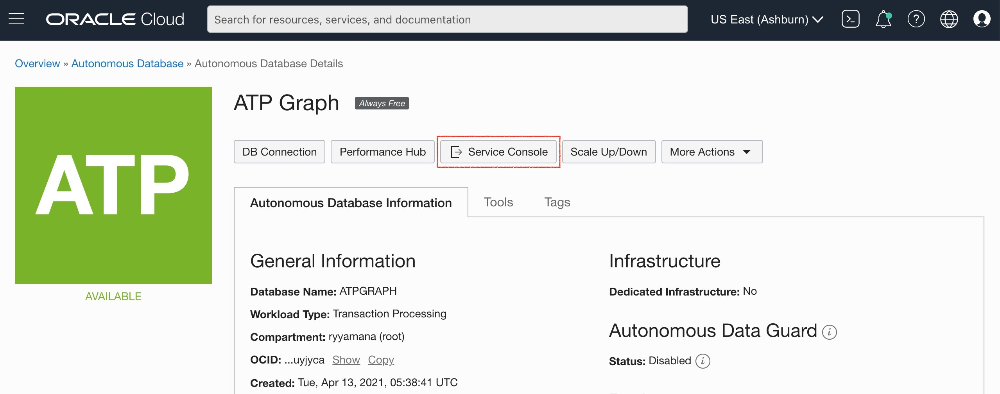
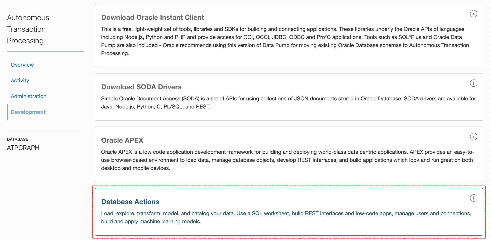
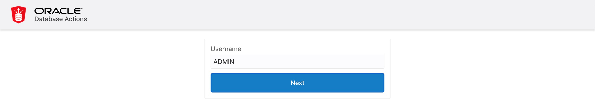
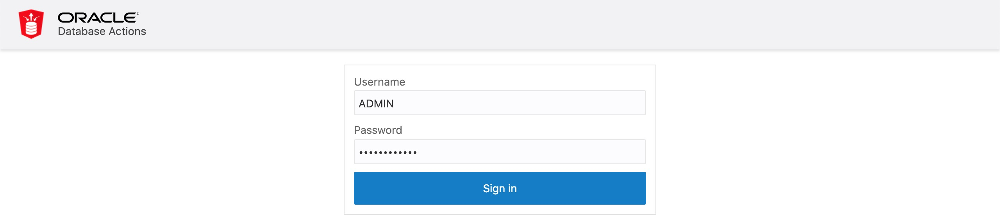
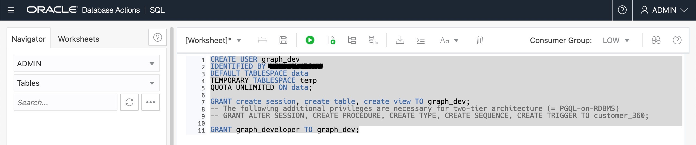
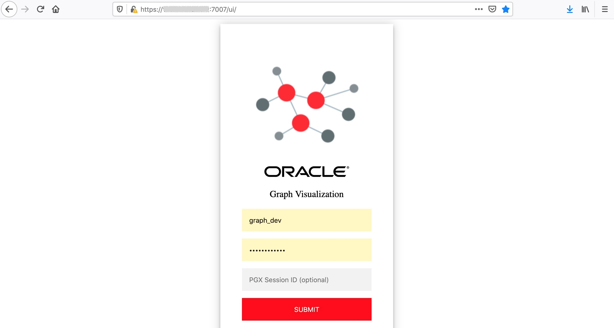
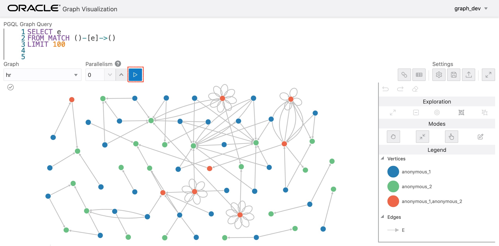

# Create Database Roles and User

## Introduction

This lab walks you through the steps to get started with SQL Developer Web. You will learn how to create a user in SQL Developer Web and provide that user the access to SQL Developer Web.

Estimated time: 10 minutes

### Objectives

- Learn how to setup the required database roles
- Learn how to create a database user

### Prerequisites

- An ADB instance provisioned in the previous step
- A Graph Server instance provisioned in the previous step

## **STEP 1:** Login to SQL Developer Web

Login as the Admin user in SQL Developer Web of the newly created ADB instance.

Go to your Cloud Console, click **Autonomous Transaction Processing**. Select the ADB instance **ATP Graph** you created in Lab 2.


In Autonomous Database Details page, click **Service Console**. Make sure your brower allow pop-up windows.



Choose Development from the list on the left, then click the **SQL Developer Web**.



Enter `ADMIN` as Username and go next.



Input the password (you set up at Lab 2 S tep 2, Section 7) and sign in.



Logged in as the `ADMIN` user. 


## **STEP 2:** Create the roles required

Now create the roles required for the graph feature. Enter the following commands into the SQL Worksheet and run it while connected as the Admin user.

Create the roles required by the graph server.

```
<copy>
DECLARE
  PRAGMA AUTONOMOUS_TRANSACTION;
  role_exists EXCEPTION;
  PRAGMA EXCEPTION_INIT(role_exists, -01921);
  TYPE graph_roles_table IS TABLE OF VARCHAR2(50);
  graph_roles graph_roles_table;
BEGIN
  graph_roles := graph_roles_table(
    'GRAPH_DEVELOPER',
    'GRAPH_ADMINISTRATOR',
    'PGX_SESSION_CREATE',
    'PGX_SERVER_GET_INFO',
    'PGX_SERVER_MANAGE',
    'PGX_SESSION_READ_MODEL',
    'PGX_SESSION_MODIFY_MODEL',
    'PGX_SESSION_NEW_GRAPH',
    'PGX_SESSION_GET_PUBLISHED_GRAPH',
    'PGX_SESSION_COMPILE_ALGORITHM',
    'PGX_SESSION_ADD_PUBLISHED_GRAPH');
  FOR elem IN 1 .. graph_roles.count LOOP
  BEGIN
    dbms_output.put_line('create_graph_roles: ' || elem || ': CREATE ROLE ' || graph_roles(elem));
    EXECUTE IMMEDIATE 'CREATE ROLE ' || graph_roles(elem);
  EXCEPTION
    WHEN role_exists THEN
      dbms_output.put_line('create_graph_roles: role already exists. continue');
    WHEN OTHERS THEN
      RAISE;
    END;
  END LOOP;
EXCEPTION
  when others then
    dbms_output.put_line('create_graph_roles: hit error ');
    raise;
END;
/
</copy>
```

Assign the default permissions to the roles, `GRAPH_DEVELOPER` and `GRAPH_ADMINISTRATOR`, to group multiple permissions together.

```
<copy>
GRANT PGX_SESSION_CREATE TO GRAPH_ADMINISTRATOR;
GRANT PGX_SERVER_GET_INFO TO GRAPH_ADMINISTRATOR;
GRANT PGX_SERVER_MANAGE TO GRAPH_ADMINISTRATOR;
GRANT PGX_SESSION_CREATE TO GRAPH_DEVELOPER;
GRANT PGX_SESSION_NEW_GRAPH TO GRAPH_DEVELOPER;
GRANT PGX_SESSION_GET_PUBLISHED_GRAPH TO GRAPH_DEVELOPER;
GRANT PGX_SESSION_MODIFY_MODEL TO GRAPH_DEVELOPER;
GRANT PGX_SESSION_READ_MODEL TO GRAPH_DEVELOPER;
</copy>
```

## **STEP 3:** Create a database user

Now create the `GRAPH_DEV` user. Enter the following commands into the SQL Worksheet and run it while connected as the Admin user.

Note: Replace **<specify_a_password>** with a valid password string.

```
<copy>
CREATE USER graph_dev
IDENTIFIED BY <specify_a_password> 
DEFAULT TABLESPACE data 
TEMPORARY TABLESPACE temp 
QUOTA UNLIMITED ON data;

GRANT create session, create table, create view TO graph_dev;
-- The following additional privileges are necessary for two-tier architecture (= PGQL-on-RDBMS)
-- GRANT ALTER SESSION, CREATE PROCEDURE, CREATE TYPE, CREATE SEQUENCE, CREATE TRIGGER TO graph_dev;

GRANT graph_developer TO graph_dev;
</copy>
```



Notes: 
- The `IDENTIFIED BY` clause specifies the password.
- The Graph Server uses database authentication. The user needs at least the graph_developer role.

## **STEP 4:** Connect to Graph Server

Open the GraphViz at `https://<public_ip_for_compute>:7007/ui`. Replace `<public_ip_for_compute>` with the one for your Graph Server compute instance.

You should see a screen similar to the screenshot below. Enter the username (`graph_dev`) and password you entered when createing the user in SQL Developer Web.



If you can login successfully, your Graph Server is properly connected to the database for authentication. Now, you will see that a sample graph called `hr` is already loaded. Try running the simple PGQL query shown by default against the graph.



Congraturation, your Graph Server is ready!

This sample graph is pre-loaded only on memory, but the actual graphs should be loaded from database in real use cases. Please proceed to the use case workshops.

## Acknowledgements

* **Author** - Jayant Sharma, Product Manager, Spatial and Graph.
* **Contributors** - Thanks to Jenny Tsai for helpful, constructive feedback that improved this workshop. Arabella Yao, Product Manager Intern, Database Management.
* **Last Updated By/Date** - Ryota Yamanaka, April 2021
