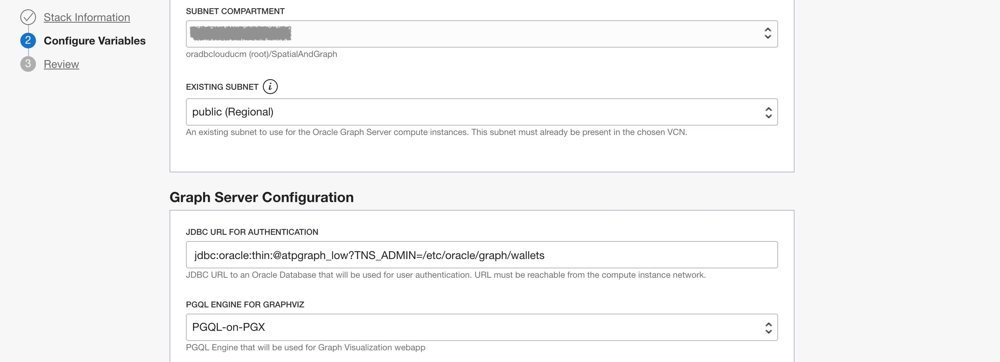
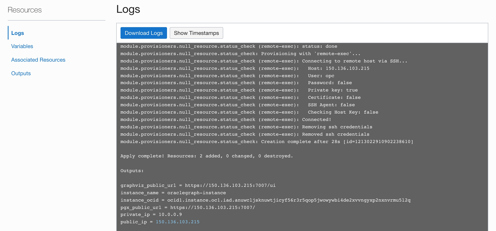
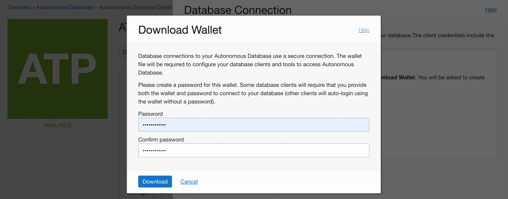

# Deploy the Graph Server & Client Marketplace Image

## Introduction

This lab walks you through the steps to deploy and configure the Graph Server and Client kit on a compute instance via an Oracle Cloud Marketplace stack. You will need to provide the SSH key, VCN and Subnet information, and the JDBC URL for the ADB instance during the deployment process.

Estimated time: 7 minutes

### Objectives

- Learn how to deploy the Graph Server and Client OCI Marketplace image.

### Prerequisites

* A cloud account
* SSH Keys to use for connecting to a compute instance
* An ADB instance with the downloaded wallet
* A VCN and Subnet

*Note 1: Some of the UIs may look a little different from the screenshots in the instructions.*

## **STEP 1:** Locate the Graph Server and Client in the Oracle Cloud Marketplace

Oracle Cloud Marketplace is an online platform which offers Oracle and partner software as click-to-deploy solutions that
are built to extend Oracle Cloud products and services.

Oracle Cloud Marketplace stacks are a set of Terraform templates that provide a fully automated end-to-end deployment of a partner solution on Oracle Cloud Infrastructure.

1. Go to your Cloud Console. Navigate to the **Marketplace** tab and enter "Graph Server and Client" in the serach bar. Click on the Oracle Graph Server and Client stack.

    

2. Select the stack and then review the System Requirements and Usage Instructions. Then select the latest version and choose a compartment and click on `Launch Stack`.

    

3. Most of the defaults are perfect for our purposes. However, you will need to choose, or provide the following:
    - Select a VM shape. Choose an Always Free eligible shape (i.e. `VM.Standard.E2.1.Micro`).
    - Paste your public SSH key. This is used when you ssh into the provisioned compute later.
    - Choose an existing virtual cloud network.
    - Select a subnet compartment and subnet.
    - Enter the JDBC URL for the ADB instance. The TNS_ADMIN entry points to the directory where you will have uploaded and unzipped the wallet, e.g. `jdbc:oracle:thin:@atpgraph_low?TNS_ADMIN=/etc/oracle/graph/wallets`

    ***Note: This JDBC URL is stored in a configuration which can be updated later if necessary.***

    
    

4. Click `Next` to initiate the Resource Manager Job for the stack. The job will take 2-3 minutes to complete.

    

    You'll see the progress in the log output.

    

    Once the job has successfully completed the status will change from "In Progess" to "Succeeded".

    

    ***NOTE:*** *On completion please make a note of `public_ip` and `graphviz_public_url`, so that you can SSH into the running instance and access the graph viz later in this lab.*

5. The next set of steps are post-install setup and configuration on the newly created compute where the Graph Server was deployed.

6. Add an Ingress Rule for port 7007 (needed later for the Graph Server).

    Using the menu, under **Networking**, click on **Virtual Cloud Networks**.

    

    Then click on the VCN you created for this lab
    

    Now click on **Security Lists** on the left navigation bar for the VCN.

    

    Click on the **Default Security List** link.

    Here you need to open port 7007. Click on **Add Ingress Rules** and add the following values as shown below:

    - **Source Type:** CIDR
    - **Source CIDR:** 0.0.0.0/0 (This setting is for testing only. Please replace to the IP address of the client machines for actual use.)
    - **IP Protocol:** TCP
    - **Source Port Range:** All
    - **Destination Port Range:** 7007
    - Click on **Add Ingress Rules** at the bottom.

    

7. To connect to the instance, go the environment where you generated your SSH Key. You can use `Oracle Cloud Shell`, `Terminal` if you are using MAC, or `Gitbash` if you are using Windows. On your terminal or gitbash enter the following command:

    **Note:** For Oracle Linux VMs, the default username is `opc`

    If your SSH Keys are kept under `HOME/.ssh/` directory, run:
    ```
    <copy>ssh opc@<public_ip_address></copy>
    ```

    If you have a different path for your SSH key, enter the following:

    ```
    <copy>ssh -i <path_to_private_ssh_key> opc@<public_ip_address></copy>
    ```

## **STEP 2:** Upload ADB Wallet, Configure your Compute Instance.

The steps are as follows:

  - Copy the ADB wallet zip file into the compute.
  - Create the `wallets` directory. Unzip the ADB wallet into that directory.
  - Change the permissions on the wallets directory so that the user `oraclegraph` and members of the group `oraclegraph` have access to that directory.

SSH into the compute instance using the private key you created earlier. First navigate to the folder where you created your SSH Keys. And connect using:

```
<copy>ssh -i <private_key> opc@<public_ip_for_compute></copy>
```

Download your ADB Wallet if you haven't done so. Go to your Cloud console, under **Database**, select **Autonomous Transaction Processing**. If you don't see your instance, make sure the **Workload Type** is **Transaction Processing** or **All**.


Click on your Autonomous Database instance. In your Autonomous Database Details page, click **DB Connection**.


In Database Connection window, select **Instance Wallet** as your Wallet Type, click **Download Wallet**.


In the Download Wallet dialog, enter a wallet password in the Password field and confirm the password in the Confirm Password field. The password must be at least 8 characters long and must include at least 1 letter and either 1 numeric character or 1 special character. This password protects the downloaded Client Credentials wallet.

Click **Download** to save the client security credentials zip file.


By default the filename is `Wallet_<DATABASE_NAME>.zip` e.g. `Wallet_ATPGRAPH.zip`. You must protect this file to prevent unauthorized database access.

Content in this section is adapted from [Download Client Credentials (Wallets)](https://docs.oracle.com/en/cloud/paas/autonomous-data-warehouse-cloud/user/connect-download-wallet.html#GUID-B06202D2-0597-41AA-9481-3B174F75D4B1)

## **STEP 3:**  Copy ADB Wallet to the Linux Compute

On your desktop or laptop, we'll assume the ADB wallet was downloaded to ~/Downloads.

Open a new Terminal, navigate to the folder where you created your SSH Keys, and enter the following command:

```
<copy>
scp -i <private_key> ~/Downloads/<ADB_Wallet>.zip opc@<public_ip_for_compute>:/etc/oracle/graph/wallets
</copy>
```

Example:
```
scp -i key.pem ~/Downloads/Wallet_ATPGRAPH.zip opc@203.0.113.14:/etc/oracle/graph/wallets
```

## **STEP 4:** Unzip ADB Wallet

Now connect to the compute instance (via SSH) as `opc` user.

```
scp -i <private_key> opc@<public_ip_for_compute>
```

Example:
```
scp -i key.pem opc@203.0.113.14
```

Unzip the ADB wallet to the `/etc/oracle/graph/wallets/` directory.

```
<copy>
cd /etc/oracle/graph/wallets/
unzip Wallet_ATPGRAPH.zip
chgrp oraclegraph *
</copy>
```

The above is just one way of achieving the desired result, i.e. giving the `oraclegraph` user access to the ADB wallet. There are alternative methods.

Check that you used the right service name in the JDBC URL you entered when configuring the OCI stack. It can be updated if necessary.

```
<copy>cat /etc/oracle/graph/wallets/tnsnames.ora</copy>
```

You will see something similar to:
``` 
atpgraph_low =
    (description=
        (address=
            (https_proxy=proxyhostname)(https_proxy_port=80)(protocol=tcps)(port=1521)
            (host=adwc.example.oraclecloud.com)
        )
        (connect_data=(service_name=adwc1_low.adwc.oraclecloud.com))
        (security=(ssl_server_cert_dn="adwc.example.oraclecloud.com,OU=Oracle BMCS US,O=Oracle Corporation,L=Redwood City,ST=California,C=US"))
)
```

An entry in tnsnames.ora is of the form:
```
<addressname> =  
    (DESCRIPTION =  
        (ADDRESS_LIST =  
            (ADDRESS = (PROTOCOL = TCP)(Host = <hostname>)(Port = <port>))
        )
        (CONNECT_DATA =
            (SERVICE_NAME = <service_name>)
        )
)
```

Note the `addressname`, e.g. `atpgraph_low` is used when connecting to the databases using JDBC.

You may now proceed to the next lab.

## Acknowledgements

* **Author** - Jayant Sharma, Product Manager, Spatial and Graph
* **Contributors** - Thanks to Jenny Tsai for helpful, constructive feedback that improved this workshop. Arabella Yao, Product Manager Intern, Database Management.
* **Last Updated By/Date** - Ryota Yamanaka, April 2021
