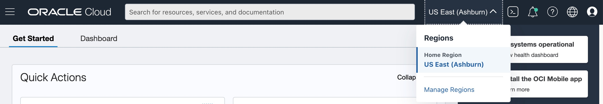
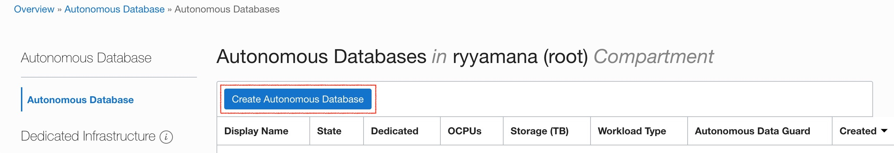
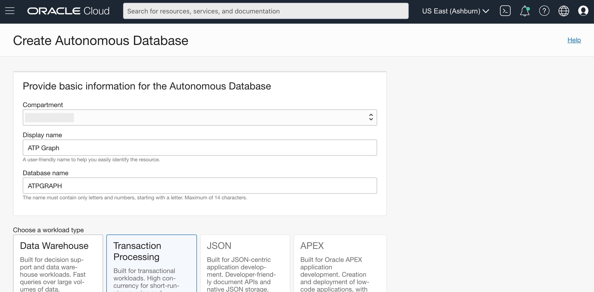
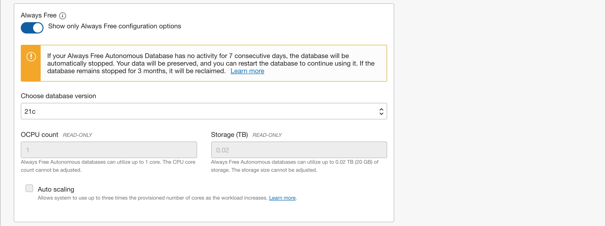
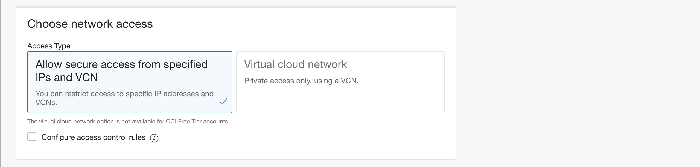
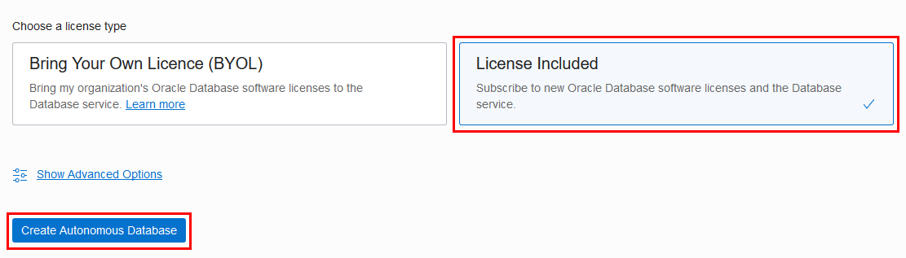
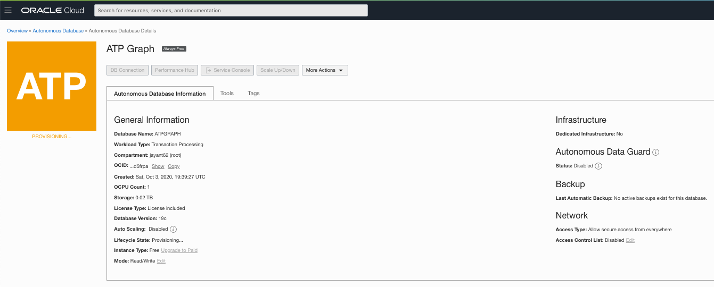
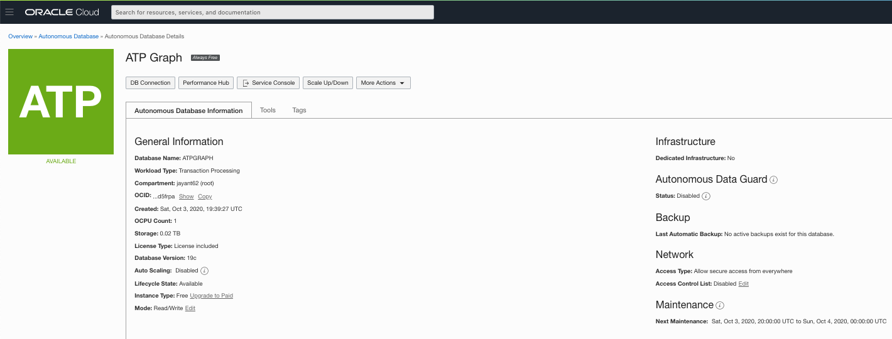

# Provision Autonomous Database Shared Instance

## Introduction

This lab walks you through the steps to get started using the Oracle Autonomous Database on Oracle Cloud. You will provision a new ATP (= Autonomous Transaction Processing) instance using the cloud console, while the steps are identical with an ADW (= Autonomous Data Warehouse) instance.*

*Note: If you want to create an Always Free autonomous database, you need to be in a region where Always Free Resources are available. (Not all regions have Always Free Resources)*

Estimated time: 10 minutes

Watch a video demonstration of provisioning an autonomous database in Autonomous Transaction Processing (same steps apply to provisioning an autonomous database in Autonomous Data Warehouse):

### Objectives

- Learn how to provision a new ATP instance

### Prerequisites

- A VCN and Subnet

## **STEP 1**: Choose ATP from the Services Menu

1. Login to the Oracle Cloud.

2. Once you are logged in, you are taken to the cloud services dashboard where you can see all the services available to you. Click the navigation menu in the upper left to show top level navigation choices.

    

3. The following steps apply similarly to either Autonomous Data Warehouse or Autonomous Transaction Processing. This lab shows provisioning of an Autonomous Transaction Processing (ATP) database, so click **Autonomous Transaction Processing**.

    

4. You can use the **List Scope** drop-down menu to select a Compartment. Select your **root compartment**, or **another compartment of your choice** where you will create your new ATP instance. If you want to create a new compartment or learn more about them, click [here](https://docs.cloud.oracle.com/iaas/Content/Identity/Tasks/managingcompartments.htm#three).

    Note: Avoid the use of the ManagedCompartmentforPaaS compartment as this is an Oracle default used for Oracle Platform Services.

    

5. You can see your current default **region** in the top, right hand corner of the page. You can select a different region. If you want to create an Always Free ADB, go ahead and select a region where Always Free Resources are available.

    

## **STEP 2**: Creating the ADB instance

1. Click **Create Autonomous Database** to start the instance creation process.

    

2.  This brings up the **Create Autonomous Database** screen where you will specify the configuration of the instance.

3. Provide basic information for the Autonomous Database:

    - **Choose a compartment** - Select a compartment for the database from the drop-down list.
    - **Display Name** - Enter a memorable name for the database for display purposes. For this lab, use **ATP Graph**.
    - **Database Name** - Use letters and numbers only, starting with a letter. Maximum length is 14 characters. For this lab, use **ATPGRAPH**.

4. Choose a workload type. Select the workload type for your database from the choices:

    - **Transaction Processing** - For this lab, choose **Transaction Processing** as the workload type.
    - **Data Warehouse** - Alternately, you could have chosen Data Warehouse as the workload type.

    

5. Choose a deployment type. Select the deployment type for your database from the choices:

    - **Shared Infrastructure** - For this lab, choose **Shared Infrastructure** as the deployment type.
    - **Dedicated Infrastructure** - Alternately, you could have chosen Dedicated Infrastructure as the workload type.

    

6. Configure the database, select the **Always Free** option:

    - **Always Free** - For this lab, you can select this option to create an always free autonomous database, or not select this option and create a database using your paid subscription. An always free database comes with 1 CPU and 20 GB of storage. Selecting Always Free will suffice for this lab.
    - **Choose database version** - Select a database version from the available versions. Both 19c and 21c are supported for using properth graph feature.
    - **OCPU Count** - Number of CPUs for your service. For this lab, choose an always free database, which comes with 1 CPU.
    - **Storage (TB)** - Select your storage capacity in terabytes. For this lab, specify **1 TB** of storage. Or, if you choose an always free database, it comes with 20 GB of storage.
    - **Auto scaling** - For this lab, keep auto scaling should be **disabled**.
    - **New Database Preview** - If a checkbox is available to preview a new database version, do **not** select it.

    

7. Create administrator credentials:

    - **Password and Confirm Password** - Specify the password for ADMIN user of the service instance. The password must meet the following requirements:
    - The password must be between 12 and 30 characters long and must include at least one uppercase letter, one lowercase letter, and one numeric character.
    - The password cannot contain the username.
    - The password cannot contain the double quote (") character.
    - The password must be different from the last 4 passwords used.
    - The password must not be the same password that is set less than 24 hours ago.
    - Re-enter the password to confirm it. Make a note of this password.

    

8. Choose network access. For this lab, accept the default, **Allow secure access from specified IPs and VCN**:

    

9. Choose a license type. For this lab, choose **License Included**. The two license types are:

    - **Bring Your Own License (BYOL)** - Select this type when your organization has existing database licenses.
    - **License Included** - Select this type when you want to subscribe to new database software licenses and the database cloud service.

10. Click **Create Autonomous Database**.

    

11.  Your instance will begin provisioning. In a few minutes the state will turn from Provisioning to Available. At this point, your Autonomous Transaction Processing database is ready to use!
    
    

You may now proceed to the next lab.

## Want to Learn More?

Click [here](https://docs.oracle.com/en/cloud/paas/autonomous-data-warehouse-cloud/user/autonomous-workflow.html#GUID-5780368D-6D40-475C-8DEB-DBA14BA675C3) for documentation on the typical workflow for using Autonomous Data Warehouse.

## Acknowledgements

- **Author** - Nilay Panchal
- **Contributors** - Richard Green, Arabella Yao
- **Last Updated By/Date** - Ryota Yamanaka, April 2020

